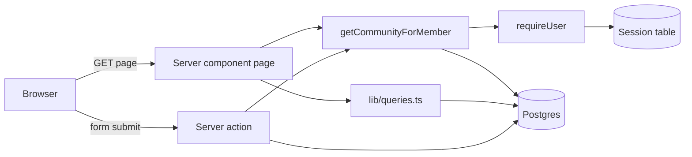

# Architecture

Koto is a single Next.js 15 app using the App Router. Pages are React server
components that read the database directly; the only writes go through server
actions. There is no separate API.

## Stack

| Layer | Choice |
| --- | --- |
| Framework | Next.js 15 (App Router, Turbopack in development), React 19 |
| Language | TypeScript |
| Styling | Tailwind CSS v4, colours as CSS variables, icons from lucide-react |
| Database | PostgreSQL |
| ORM | Prisma 7 with the `@prisma/adapter-pg` driver adapter |
| Auth | Hand-rolled: scrypt from `node:crypto`, sessions in the database |

## How a request flows



1. A page resolves who is signed in and which community they are looking at
   through `getCommunityForMember(slug)`. That one call is both the
   authentication and the authorisation check (see
   [Tenancy and access](tenancy-and-access.md)).
2. With the community's id in hand, the page reads notices through
   `src/lib/queries.ts`, always scoped by `communityId`.
3. Forms call server actions. An action repeats the same checks itself, because
   a server action is a public endpoint that anything can call, not just the
   form.

## Code layout

```
prisma/
  schema.prisma              all models and enums
  migrations/                SQL migrations, committed (several written by hand)
  seed.ts                    example community, members and notices
src/
  app/                       routes (see routes.md)
    (auth)/                  /login and /signup, their layout and actions
    community/[slug]/        everything inside one community
  components/                shared UI: AppShell, Sidebar, BottomTabs, ...
  lib/
    db.ts                    the Prisma client singleton
    password.ts              scrypt hashing
    session.ts               database sessions and the cookie
    auth.ts                  getCurrentUser, requireUser
    community.ts             community lookups, including the membership check
    queries.ts               notice reads, all scoped by communityId
    notices.ts               category labels, badge styles, date formatting
  generated/prisma/          generated Prisma client (gitignored)
  globals.css                colour variables
```

## Conventions

- **Reads go through `lib/`, never `prisma.*` straight from a page.** The
  functions in `lib/` take a `communityId` as a required argument, so forgetting
  the tenant filter is a type error instead of a data leak.
- **Ask the database for what the page shows.** A page that renders three cards
  asks for three rows (`take: 3`); counts are counted in SQL
  (`getNoticeCounts`), not by loading every row and calling `.length`.
- **Per-request caching with React `cache`.** `getCurrentUser`,
  `getCommunityForMember` and `getNotice` are wrapped in it, so a layout, a page
  and `generateMetadata` asking the same question share one query.
- **Comments explain why.** The code is commented heavily with the reasoning
  behind each decision. Read them before changing something that looks odd.

## Prisma 7 specifics

- The client is generated into `src/generated/prisma`, not `node_modules`.
- It connects through a driver adapter, so `src/lib/db.ts` builds the client
  with `new PrismaPg({ connectionString })`.
- The database URL is read in `prisma.config.ts`, not in `schema.prisma`.
- In development the client is kept on `globalThis` so hot reload does not open
  a new connection pool per edit. The catch: after `prisma generate` the dev
  server keeps using the **old** client until it is restarted.
