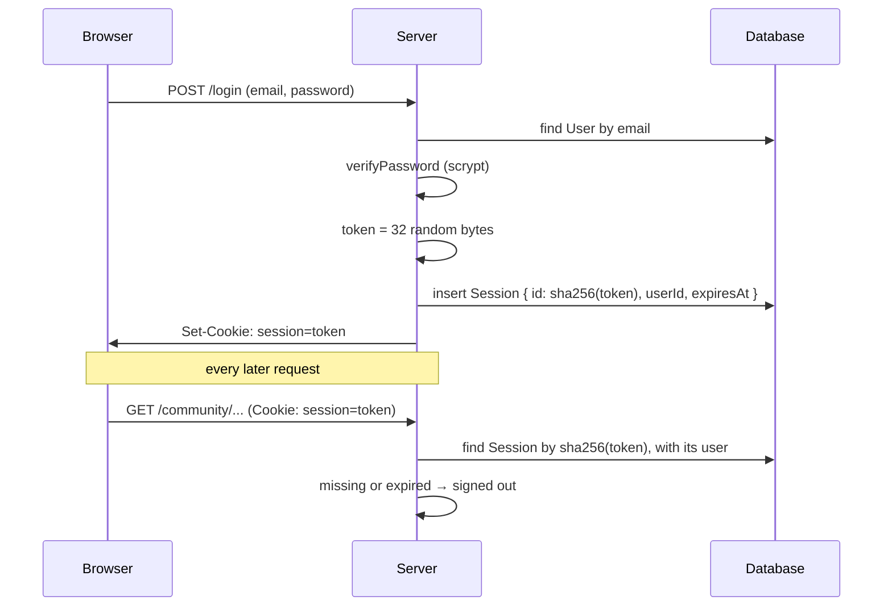

# Authentication

Koto's authentication is written by hand rather than with a library, so every
part of it is readable in the repository. Passwords are hashed with scrypt from
Node's standard library, and sessions live in the database behind a cookie.

Authentication only answers *who you are*. What you may see is decided by
memberships; see [Tenancy and access](tenancy-and-access.md).

## The modules

| File | Responsibility |
| --- | --- |
| `src/lib/password.ts` | `hashPassword`, `verifyPassword` |
| `src/lib/session.ts` | `createSession`, `readSession`, `deleteSession`, the cookie |
| `src/lib/auth.ts` | `getCurrentUser()` (cached per request), `requireUser()` |
| `src/app/(auth)/actions.ts` | The `signUp`, `signIn` and `signOut` server actions |
| `src/app/(auth)/AuthForm.tsx` | The sign-in and sign-up form, one component for both |

In pages and actions, use `requireUser()` when a user is required (it redirects
to `/login` otherwise) and `getCurrentUser()` when being signed out is fine.
Nothing outside `lib/auth.ts` should call `readSession` directly.

## Passwords

```
scrypt$65536$8$2$<salt>$<hash>
```

That is what `User.passwordHash` holds: the algorithm, its parameters, a random
salt and the derived key.

- **scrypt is slow on purpose.** One hash takes a noticeable fraction of a
  second and about 64 MiB of memory. A user signing in never notices; an
  attacker with a stolen database pays that on every one of the billions of
  guesses they want to make. A fast hash like SHA-256 would let them guess on a
  GPU in hours.
- **The parameters** (N = 65536, r = 8, p = 2) are one of OWASP's recommended
  settings. They are stored in each hash, so raising them later only affects new
  hashes, and old ones still verify.
- **Each password gets its own random salt**, so two people with the same
  password get different hashes, and cracking one reveals nothing about the
  other.
- **The comparison is constant-time** (`timingSafeEqual`). `===` stops at the
  first differing byte, and that timing can be measured.
- **Rules:** 8 to 200 characters, no composition rules. Current NIST guidance is
  that "one capital, one digit" rules make passwords harder to remember without
  making them harder to guess. The upper limit stops anyone making the server
  hash a megabyte.

## Sessions

Signing in creates a session that lasts 30 days.



**Only the hash of the token is stored.** A database leak hands over hashes that
cannot be turned back into working cookies. Plain SHA-256 is enough here, unlike
for passwords: the token is 32 random bytes, not something a person chose, so
there is nothing to guess.

**Signing out deletes the row** and the cookie. Because the session is checked
against the database on every request, deleting a user's session rows signs
them out everywhere at once.

**The session lookup never selects `passwordHash`.** Only `id`, `email` and
`name` leave `readSession`, so the hash cannot end up rendered into a page by
accident.

### The cookie

| Setting | Why |
| --- | --- |
| `httpOnly` | JavaScript on the page cannot read it, so an XSS bug cannot steal it |
| `secure` in production | Only sent over HTTPS (off locally, where the dev server is plain HTTP) |
| `sameSite: "lax"` | Not sent on cross-site POSTs, the usual CSRF route; still sent when following a link from an email |
| `path: "/"`, `expires` | Whole site, same lifetime as the database row |

Next.js only allows setting cookies in server actions and route handlers, not
while rendering a page. That is why sessions are created and deleted only in the
auth actions.

## Sign-up, sign-in, sign-out

**Sign-up** validates the name, email and password, lowercases the email, hashes
the password, inserts the user, creates a session and redirects to `/`.
Duplicate emails are caught by the unique index on `User.email` (Prisma error
`P2002`), not by a lookup beforehand: two sign-ups racing for one address would
both pass a check-then-insert.

**Sign-in** looks the user up by lowercased email and verifies the password.
Two details keep it from revealing which emails have accounts:

- A wrong email and a wrong password get the same message, "Wrong email or
  password."
- An unknown email is still checked against a decoy hash, so both cases take
  the same time. Otherwise response time alone would tell an attacker which
  addresses exist.

Sign-up *does* say "There is already an account with that email", which reveals
the same thing. That is the usual trade-off; closing it needs email
verification, which is not built yet.

**Sign-out** is a `<form>` with a button, not a link. Signing out changes state
on the server, and browsers and crawlers fetch links ahead of time; a GET link
would sign people out on its own.

### The form

`AuthForm.tsx` uses `useActionState`, which hands the action's return value back
to the form as `state`. The form works as a plain HTML form even before the
JavaScript loads. React resets a form after its action runs, so the email and
name are sent back in `state` and refilled; the password never is.

## Why there is no middleware

A `middleware.ts` could redirect signed-out visitors before the page renders.
It is left out on purpose: it cannot replace the check in each page (Next.js
renders layouts and pages independently, and a page's data fetching does not
wait for anything else to pass), and having the same rule in two places means
two places for it to be wrong.

## Not built yet

- Rate limiting on sign-in (nothing stops unlimited password guesses)
- Email verification and password reset
- Sliding session renewal, and cleaning up expired session rows
