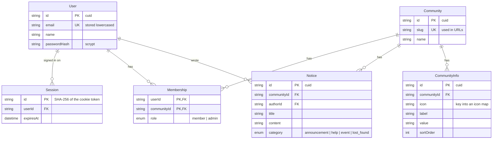

# Data model

Six tables. `Community` is the tenant; everything that belongs to one carries
its `communityId`. `User` is global, so one person can belong to several
communities through `Membership`.

Timestamps are left out of the diagram: `User`, `Community` and `Notice` have
`createdAt` and `updatedAt`, `Session` and `Membership` only `createdAt`, and
`CommunityInfo` neither. The schema itself is
in [`prisma/schema.prisma`](../prisma/schema.prisma), commented model by model.

## The tables

| Table | One row is | Notes |
| --- | --- | --- |
| `Community` | A community with its own board | The tenant boundary. `slug` is unique and appears in every URL. |
| `CommunityInfo` | A "Good to know" line on the community home page | Separate table because every community has different ones. |
| `Notice` | One post on a board | `authorId` points at the `User` who posted it. |
| `User` | A person with a login | Global, not per community. |
| `Session` | One signed-in browser | Deleting the row signs that browser out. |
| `Membership` | A user belonging to a community | What authorisation checks. Primary key is the pair. |

## Design decisions

**Every id is a cuid.** `Notice.id` used to be an autoincrement integer. A
counter shared by every tenant makes notice URLs guessable and lets one
community read the platform's total volume off its own ids. The migration gave
existing notices fresh random ids rather than keeping `"13"`, `"14"`.

**No stored member count.** `Community.memberCount` used to be a typed-in
number. A stored count drifts the moment someone joins or leaves without it
being updated, so it is now `_count: { memberships: true }`.

**`Session.id` is a hash, not the token.** The cookie holds a random token; the
table holds its SHA-256. Someone who reads the database cannot turn that back
into a working cookie. See [Authentication](authentication.md).

**`Membership` has a composite primary key `(userId, communityId)`.** Nobody can
be a member of the same community twice, and the key's index (starting with
`userId`) serves "my communities". A second index on `communityId` serves
"members of this community".

**Cascades.** Deleting a community deletes its notices, info rows and
memberships. Deleting a user deletes their sessions, memberships and notices.
Keeping a deleted user's notices under "deleted user" would need an optional
relation; that is a product decision for when account deletion exists.

**Indexes follow the queries.** Every notice read filters by community and sorts
by date, so the index is `(communityId, createdAt)`, not `createdAt` alone.
`Notice.authorId` and `Session.userId` are indexed because Postgres does not
index foreign key columns on its own, and cascading deletes need to find those
rows.

## Migrations

Migrations live in `prisma/migrations/` and are committed. Several were written
by hand, because Prisma's generated SQL would have lost or mangled data:

| Migration | Why by hand |
| --- | --- |
| `rename_building_to_community` | Prisma would have dropped and recreated the tables. Written as renames. |
| `notice_cuid` | Prisma would have cast ids to text (`"13"`), keeping them guessable. Gives each row a new random id. |
| `notice_author_user` | Prisma would have added a required column that fails on existing rows and dropped the author names. Backfills `authorId` by matching names to members of the same community, and fails rather than guess when one does not match. |

The rule of thumb: generate the SQL, then **read it** before applying it. If it
drops a column or table that holds data you want, write the migration yourself.
How to do that is in [Development](development.md#changing-the-schema).
