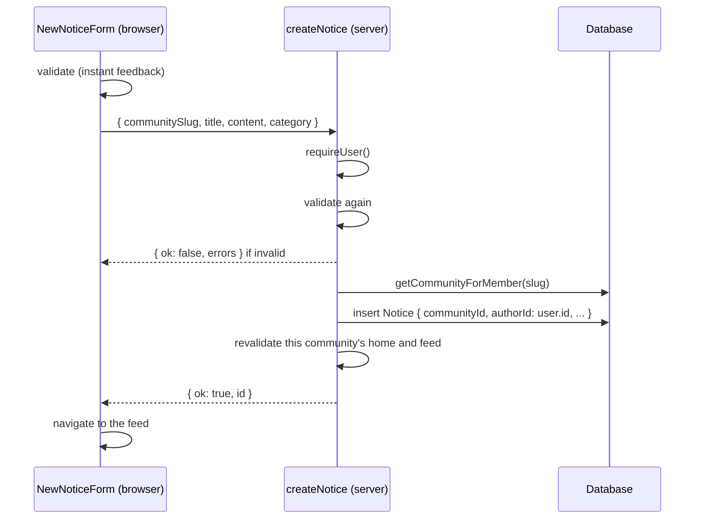

# Notices

A notice is one post on a community's board: a title, some text, a category and
an author. Reading goes through `src/lib/queries.ts`; posting goes through the
`createNotice` server action.

## Categories

| Value | Label | Badge colour |
| --- | --- | --- |
| `announcement` | Announcement | Blue |
| `help` | Help needed | Purple |
| `event` | Event | Amber |
| `lost_found` | Lost & found | Grey |

The values are a Postgres enum (`NoticeCategory`). Labels and badge classes live
in `src/lib/notices.ts`, keyed by the same values, so adding a category means
the enum, a migration, and one entry in each map. TypeScript flags a missing
entry.

## Reading

| Function | Returns | Used by |
| --- | --- | --- |
| `getNotices(communityId, { category?, take? })` | Notices newest first, each with `author.name` | Community home (latest 3, help requests up to 5), feed (all) |
| `getNotice(communityId, id)` | One notice with `author.name`, or `null` | Notice page and its `generateMetadata` |
| `getNoticeCounts(communityId)` | `{ announcement, help, event, lost_found, total }` | Stats on the community home |

- **Only the author's name is loaded.** A notice is rendered into pages, and the
  author's email or password hash has no business travelling with it.
- **Narrow queries.** The home page shows at most eight notices, so it asks for
  them with `take` instead of loading the board and slicing it. The counts are
  one `GROUP BY` in Postgres. Categories with no notices come back as `0`, not
  missing.
- **The feed is the exception.** It loads every notice by design and is the one
  read that grows with the community. Pagination goes there when it is needed.

The home page's stats are simple counts: "Active notices" is every notice and
"Upcoming events" is every notice in the `event` category. Nothing expires or
looks at dates yet.

## Posting

**Validation runs twice.** The form checks as you submit so mistakes show at
once; the action checks again because anything can call it. The rules:

| Field | Rule |
| --- | --- |
| Title | Not empty after trimming |
| Content | At least 10 characters after trimming |
| Category | One of the four values |

Field errors come back as `{ ok: false, errors }` and appear under each field.
Anything thrown (database down, not a member) shows a "Nothing was posted" box
instead.

**The author is not a form field.** It is taken from the session. The form gets
the signed-in user's name only to show it in the preview.

**Revalidation is scoped.** After posting, only that community's home page and
feed are revalidated; other tenants' pages are left alone.

## The notice page

`/community/[slug]/notice/[id]` shows one notice in full, keeping the line
breaks the author typed (the cards on the board collapse them). It is narrower
than the boards (`max-w-3xl`) because it is a single column of prose. The
notice is looked up by its id **and** the community's id, so an id from another
community is a 404.

## Not built yet

- Comments: the Comment button on feed cards does nothing, and there is no
  comment model.
- Editing and deleting notices.
- Pagination on the feed.
- A category filter in the UI (`getNotices` already supports one).
- Localised dates: `formatNoticeDate` always formats as `en-US`.
